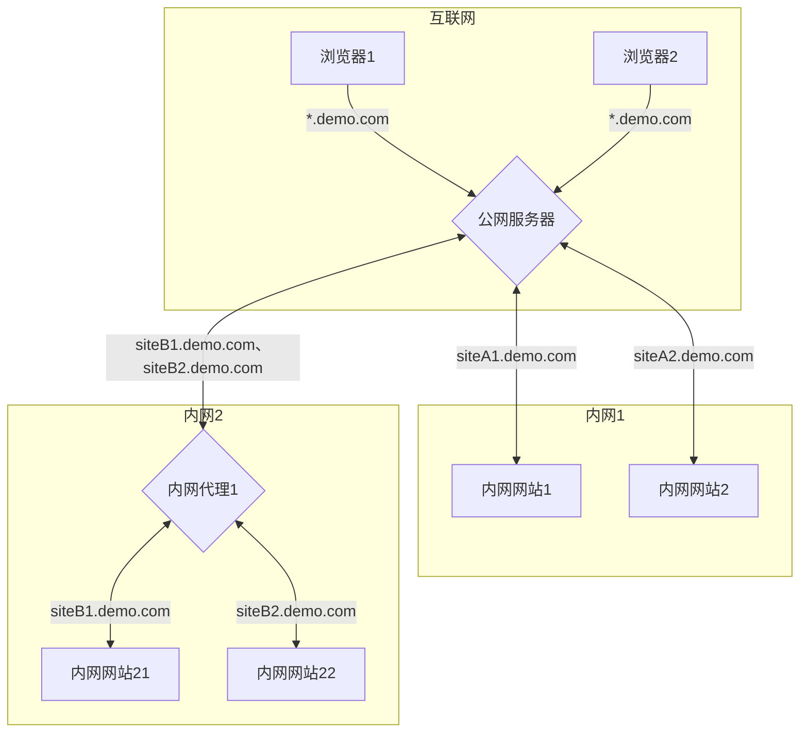

# 内网穿透例子

## 例子说明

该例子是一个内网穿透的例子，流程如下：

## 说明

- Cyarp.Sample.PublicReverseProxy 为部署在互联网服务器的反向代理服务，负责将请求转发到内网网站。
- Cyarp.Sample.IntranetSite1、Cyarp.Sample.IntranetSite1 为运行于公司内网服务器的网站，也可以运行在容器中，只要能访问公网服务器即可。

将自己域名解释到公网服务器上，比如 \*.demo.com 泛域名解释到 PublicReverseProxy 所在服务器  
IntranetSite1、IntranetSite2 在 Appsettings.json 中配置 ConnectHeaders:HOST 为 siteA1.demo.com、siteA2.demo.com

## 开发环境测试

同时启动 aspnet-sites-tunnel.sln 解决方案中的所有项目，通过本目录下的 test.http 进行测试访问  
如果要从浏览器访问测试，可在电脑 hosts 文件中将 siteA1.demo.com siteA1.demo.com 都指向 127.0.0.1  
即可使用浏览器访问 http://siteA1.demo.com:5080、http://siteA2.demo.com:5080  
5080 为 PublicReverseProxy 的端口
